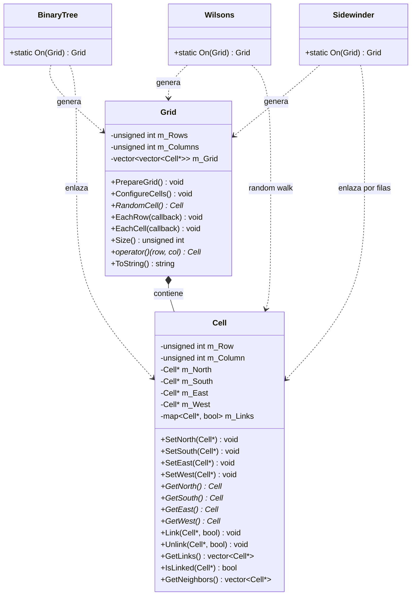
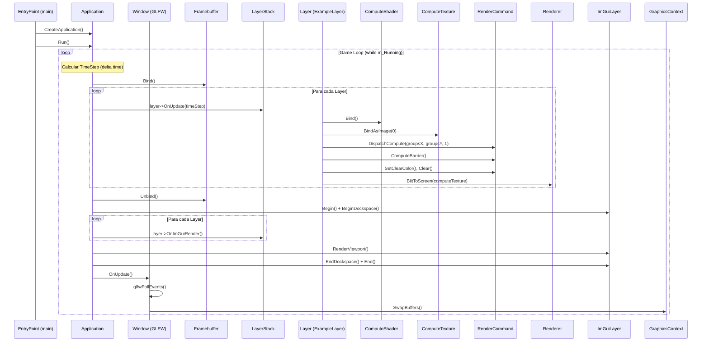
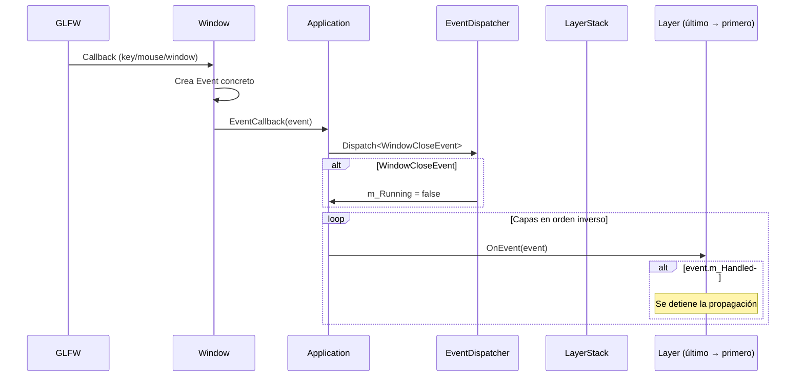
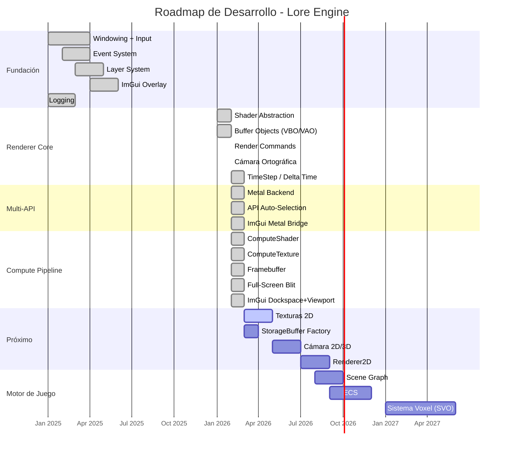

# Lore Engine

**Lore Engine** es un motor de juegos cross-platform enfocado en manipulación voxel, construido con C++ moderno y un sistema de renderizado multi-API (OpenGL 4.1 en Windows, Apple Metal en macOS).

El proyecto cuenta con un **pipeline de renderizado completo** incluyendo compute shaders, framebuffers offscreen, un compositor dockeable con ImGui, y selección automática de API gráfica por plataforma.

---

## Características Implementadas

- **Soporte Cross-Platform**: Windows (x64) con OpenGL 4.1 y macOS (ARM64) con Apple Metal
- **Multi-API Rendering**: Selección automática de backend gráfico en tiempo de compilación (OpenGL / Metal)
- **Compute Shader Pipeline**: Dispatch de compute shaders con texturas de escritura/lectura y blit a pantalla completa
- **Framebuffer Offscreen**: Renderizado a textura con resize dinámico e integración en viewport ImGui
- **Renderer Abstraction**: Sistema completo con Shader, VertexBuffer, IndexBuffer, VertexArray, StorageBuffer, RenderCommand y Renderer
- **Cámara Ortográfica**: OrthographicCamera con posición, rotación y matrices View/Projection
- **Delta Time (TimeStep)**: Clase `TimeStep` con delta time por frame, pasado a `Layer::OnUpdate()`
- **Matemáticas con glm**: Vectores, matrices y transformaciones integradas
- **Arquitectura por Capas**: Sistema modular de `Layer`/`LayerStack` para organizar lógica de juego y renderizado
- **Sistema de Eventos**: Despacho inmediato con tipado seguro y categorías (Application, Input, Keyboard, Mouse)
- **ImGui con Dockspace**: Overlay de Dear ImGui con dockspace, auto-layout, viewport de framebuffer y soporte multi-viewports
- **Sistema de Logging**: Logger dual (Core/Client) sobre spdlog con formato coloreado
- **Input Polling**: Consulta de estado de teclado y ratón en cualquier momento del frame
- **Soporte Retina/HiDPI**: `GetFramebufferWidth()`/`GetFramebufferHeight()` para resoluciones de display escaladas

---

## Arquitectura

### Diagrama General

```mermaid
graph TB
    subgraph Sandbox["Sandbox (ConsoleApp)"]
        SandboxApp["Sandbox : Application"]
        ExampleLayer["ExampleLayer : Layer"]
        SandboxApp -->|PushLayer| ExampleLayer

        subgraph ComputeDemo["Compute-First Pipeline"]
            CompShader["ComputeShader"]
            CompTexture["ComputeTexture"]
            CompShader --> CompTexture
        end
        ExampleLayer --> ComputeDemo

        subgraph MazeModule["Maze Module"]
            MazeGrid["Grid<br/><i>matriz de celdas</i>"]
            MazeCell["Cell<br/><i>conexiones N/S/E/W</i>"]
            BinaryTree["BinaryTree<br/><i>algoritmo generador</i>"]
            Wilsons["Wilsons<br/><i>random walk sin loops</i>"]
            Sidewinder["Sidewinder<br/><i>generación por filas</i>"]
            MazeGrid -->|contiene| MazeCell
            BinaryTree -->|genera| MazeGrid
            Wilsons -->|genera| MazeGrid
            Sidewinder -->|genera| MazeGrid
        end
        ExampleLayer --> MazeModule

        subgraph SVOModule["SVO Module"]
            SVONode["SVONode<br/><i>stub placeholder</i>"]
        end
    end

    subgraph LoreEngine["Lore Engine (StaticLib)"]

        subgraph Core["Core"]
            Application["Application<br/><i>Singleton, game loop</i>"]
            EntryPoint["EntryPoint.h<br/><i>define main()</i>"]
            Log["Log<br/><i>spdlog wrapper</i>"]
            CoreH["Core.h<br/><i>macros, asserts</i>"]
            TimeStepClass["TimeStep<br/><i>delta time</i>"]
        end

        subgraph LayerSystem["Layer System"]
            LayerStack["LayerStack<br/><i>contenedor ordenado</i>"]
            Layer["Layer<br/><i>base class</i>"]
            ImGuiLayer["ImGuiLayer : Layer<br/><i>dockspace + viewport</i>"]
            LayerStack -->|contiene| Layer
            LayerStack -->|contiene| ImGuiLayer
        end

        subgraph Events["Event System"]
            Event["Event<br/><i>abstract base</i>"]
            EventDispatcher["EventDispatcher<br/><i>template dispatch</i>"]
            WindowEvents["WindowClose<br/>WindowResize"]
            KeyEvents["KeyPressed<br/>KeyReleased<br/>KeyTyped"]
            MouseEvents["MouseMoved<br/>MouseScrolled<br/>MouseButton*"]
            Event --- WindowEvents
            Event --- KeyEvents
            Event --- MouseEvents
        end

        subgraph InputSystem["Input"]
            Input["Input<br/><i>singleton virtual</i>"]
            KeyCodes["KeyCodes.h<br/><i>120+ macros</i>"]
            MouseCodes["MouseButtonCodes.h"]
        end

        subgraph Platform["Platform Layer"]
            subgraph WinPlatform["Windows"]
                WindowsWindow["WindowsWindow : Window"]
                WindowsInput["WindowsInput : Input"]
            end
            subgraph MacPlatform["macOS"]
                MacWindow["MacWindow : Window"]
                MacInput["MacInput : Input"]
            end
            subgraph OpenGLPlatform["OpenGL Backend"]
                OpenGLContext["OpenGLContext"]
                OpenGLRendererAPI["OpenGLRendererAPI"]
                OpenGLShader["OpenGLShader"]
                OpenGLBuffer["OpenGLBuffer"]
                OpenGLVA["OpenGLVertexArray"]
                OpenGLFB["OpenGLFramebuffer"]
                OpenGLCS["OpenGLComputeShader"]
                OpenGLCT["OpenGLComputeTexture"]
            end
            subgraph MetalPlatform["Metal Backend"]
                MetalContext["MetalContext"]
                MetalRendererAPI["MetalRendererAPI"]
                MetalShader["MetalShader"]
                MetalBuffer["MetalBuffer"]
                MetalVA["MetalVertexArray"]
                MetalFB["MetalFramebuffer"]
                MetalCS["MetalComputeShader"]
                MetalCT["MetalComputeTexture"]
            end
        end

        subgraph Renderer["Renderer"]
            Window["Window<br/><i>interfaz pura</i>"]
            GraphicsContext["GraphicsContext<br/><i>interfaz pura</i>"]
            RendererClass["Renderer<br/><i>BeginScene/Submit/BlitToScreen</i>"]
            RenderCommand["RenderCommand<br/><i>Draw/Compute/Blit</i>"]
            ShaderClass["Shader<br/><i>uniforms, bind</i>"]
            BufferClasses["VertexBuffer / IndexBuffer / StorageBuffer"]
            VertexArrayClass["VertexArray"]
            FramebufferClass["Framebuffer<br/><i>offscreen rendering</i>"]
            ComputeShaderClass["ComputeShader<br/><i>GPGPU dispatch</i>"]
            ComputeTextureClass["ComputeTexture<br/><i>image read/write</i>"]
            CameraClass["OrthographicCamera<br/><i>View/Projection matrices</i>"]
        end
    end

    SandboxApp -.->|extends| Application
    Application --> LayerStack
    Application --> Window
    Application --> Log
    Application --> ImGuiLayer
    Application --> FramebufferClass
    Application --> TimeStepClass
    Window -.->|implementa| WindowsWindow
    Window -.->|implementa| MacWindow
    GraphicsContext -.->|implementa| OpenGLContext
    GraphicsContext -.->|implementa| MetalContext
    Input -.->|implementa| WindowsInput
    Input -.->|implementa| MacInput
    WindowsWindow --> OpenGLContext
    MacWindow --> MetalContext
    EntryPoint -->|crea| Application

    subgraph Vendors["Dependencias (vendor/)"]
        GLFW["GLFW<br/><i>ventanas + input</i>"]
        GLAD["GLAD<br/><i>OpenGL loader</i>"]
        IMGUI["Dear ImGui<br/><i>GUI inmediata</i>"]
        spdlog["spdlog<br/><i>logging</i>"]
        glm["glm<br/><i>matrices, vectores</i>"]
        MetalFW["Metal.framework<br/><i>GPU API (macOS)</i>"]
    end

    WindowsWindow --> GLFW
    MacWindow --> GLFW
    OpenGLContext --> GLAD
    MetalContext --> MetalFW
    ImGuiLayer --> IMGUI
    Log --> spdlog
```



### Diagrama de Clases

```mermaid
classDiagram
    class Application {
        -unique_ptr~Window~ m_Window
        -ImGuiLayer* m_ImGuiLayer
        -bool m_Running
        -LayerStack m_LayerStack
        -Framebuffer* m_Framebuffer
        -TimeStep m_TimeStep
        -float m_LastFrameTime
        -static Application* s_Instance
        +Run() void
        +OnEvent(Event&) void
        +PushLayer(Layer*) void
        +PushOverlay(Layer*) void
        +static Get() Application&
        +GetWindow() Window&
        +GetFramebuffer() Framebuffer&
    }

    class TimeStep {
        -float m_Time
        +operator float()
        +GetSeconds() float
        +GetMilliseconds() float
    }

    class Renderer {
        -static SceneData* s_SceneData
        +static BeginScene(OrthographicCamera&) void
        +static Submit(VertexArray, Shader, mat4) void
        +static EndScene() void
        +static BlitToScreen(ComputeTexture) void
        +static GetAPI() API
    }

    class RenderCommand {
        -static RendererAPI* s_RendererAPI
        +static SetClearColor(vec4) void
        +static Clear() void
        +static SetViewport(x, y, w, h) void
        +static DrawIndexed(VertexArray) void
        +static DispatchCompute(gX, gY, gZ) void
        +static ComputeBarrier() void
        +static BlitToScreen(native, w, h) void
    }

    class RendererAPI {
        <<interface>>
        +SetClearColor(vec4)* void
        +Clear()* void
        +SetViewport(x, y, w, h)* void
        +DrawIndexed(VertexArray)* void
        +DispatchCompute(gX, gY, gZ)* void
        +ComputeBarrier()* void
        +BlitToScreen(native, w, h)* void
        +static GetAPI() API
    }

    class OrthographicCamera {
        -mat4 m_ProjectionMatrix
        -mat4 m_ViewMatrix
        -mat4 m_ViewProjectionMatrix
        -vec3 m_Position
        -float m_Rotation
        +SetPosition(vec3) void
        +SetRotation(float) void
        +GetViewProjectionMatrix() mat4
    }

    class Shader {
        <<interface>>
        +Bind()* void
        +Unbind()* void
        +SetUniform1f(name, float)* void
        +SetUniform2f(name, vec2)* void
        +SetUniform3f(name, vec3)* void
        +SetUniform4f(name, vec4)* void
        +SetUniformMat3f(name, mat3)* void
        +SetUniformMat4f(name, mat4)* void
        +static Create(vertex, fragment, compute) Shader*
    }

    class ComputeShader {
        <<interface>>
        +Bind()* void
        +Unbind()* void
        +static Create(computePath) ComputeShader*
        #ReadFile(path) string
    }

    class ComputeTexture {
        <<interface>>
        +BindAsImage(unit)* void
        +BindAsTexture(slot)* void
        +Resize(w, h)* void
        +GetWidth()* uint32
        +GetHeight()* uint32
        +GetNativeHandle()* void*
        +static Create(w, h) ComputeTexture*
    }

    class Framebuffer {
        <<interface>>
        +Bind()* void
        +Unbind()* void
        +Resize(w, h)* void
        +GetColorAttachmentRendererID()* void*
        +GetSpecification()* FramebufferSpecification
        +static Create(spec) Framebuffer*
    }

    class VertexArray {
        <<interface>>
        +Bind()* void
        +Unbind()* void
        +AddVertexBuffer(VertexBuffer*)* void
        +SetIndexBuffer(IndexBuffer*)* void
        +static Create() VertexArray*
    }

    class StorageBuffer {
        <<interface>>
        +Bind(slot)* void
        +Unbind()* void
        +SetData(data, size, offset)* void
        +static Create(size, binding) StorageBuffer*
    }

    class Window {
        <<interface>>
        +OnUpdate()* void
        +GetWidth()* uint
        +GetHeight()* uint
        +GetFramebufferWidth()* uint
        +GetFramebufferHeight()* uint
        +GetTime()* float
        +SetEventCallback(fn)* void
        +SetVSync(bool)* void
        +IsVSync()* bool
        +GetNativeWindow()* void*
        +static Create(WindowProps) Window*
    }

    class GraphicsContext {
        <<interface>>
        +Init()* void
        +SwapBuffers()* void
    }

    class Input {
        <<abstract>>
        -static Input* s_Instance
        +static IsKeyPressed(int) bool
        +static IsMouseButtonPressed(int) bool
        +static GetMousePosition() pair
        #IsKeyPressedImpl(int)* bool
        #IsMouseButtonPressedImpl(int)* bool
        #GetMousePositionImpl()* pair
    }

    class Layer {
        -string m_DebugName
        +OnAttach() void
        +OnDetach() void
        +OnUpdate(TimeStep) void
        +OnImGuiRender() void
        +OnEvent(Event&) void
        +GetName() string
    }

    class LayerStack {
        -vector~Layer*~ m_Layers
        -unsigned int m_LayerInsertIndex
        +PushLayer(Layer*) void
        +PushOverlay(Layer*) void
        +PopLayer(Layer*) void
        +PopOverlay(Layer*) void
        +begin() iterator
        +end() iterator
    }

    class Event {
        <<abstract>>
        +bool m_Handled
        +GetEventType()* EventType
        +GetName()* string
        +GetCategoryFlags()* int
        +IsInCategory(EventCategory) bool
        +ToString() string
    }

    class Log {
        -static shared_ptr s_CoreLogger
        -static shared_ptr s_ClientLogger
        +static Init() void
        +static GetCoreLogger()
        +static GetClientLogger()
    }

    class ImGuiLayer {
        +OnAttach() void
        +OnDetach() void
        +OnImGuiRender() void
        +Begin() void
        +End() void
        +BeginDockspace() void
        +EndDockspace() void
        +RenderViewport() void
    }

    class WindowsWindow {
        -GLFWwindow* m_Window
        -GraphicsContext* m_Context
        -WindowData m_Data
    }
    class MacWindow {
        -GLFWwindow* m_Window
        -GraphicsContext* m_Context
        -WindowData m_Data
    }

    class OpenGLContext
    class OpenGLRendererAPI
    class OpenGLShader
    class OpenGLVertexArray
    class OpenGLFramebuffer
    class OpenGLComputeShader
    class OpenGLComputeTexture

    class MetalContext
    class MetalRendererAPI
    class MetalShader
    class MetalVertexArray
    class MetalFramebuffer
    class MetalComputeShader
    class MetalComputeTexture
    class MetalStorageBuffer

    class WindowsInput
    class MacInput

    Application *-- LayerStack
    Application *-- Window
    Application *-- Framebuffer
    Application *-- TimeStep
    Application --> ImGuiLayer
    Application --> Log

    LayerStack o-- Layer
    ImGuiLayer --|> Layer

    Window <|.. WindowsWindow
    Window <|.. MacWindow
    GraphicsContext <|.. OpenGLContext
    GraphicsContext <|.. MetalContext
    RendererAPI <|.. OpenGLRendererAPI
    RendererAPI <|.. MetalRendererAPI
    Shader <|.. OpenGLShader
    Shader <|.. MetalShader
    VertexArray <|.. OpenGLVertexArray
    VertexArray <|.. MetalVertexArray
    Framebuffer <|.. OpenGLFramebuffer
    Framebuffer <|.. MetalFramebuffer
    ComputeShader <|.. OpenGLComputeShader
    ComputeShader <|.. MetalComputeShader
    ComputeTexture <|.. OpenGLComputeTexture
    ComputeTexture <|.. MetalComputeTexture
    StorageBuffer <|.. MetalStorageBuffer
    Input <|.. WindowsInput
    Input <|.. MacInput

    WindowsWindow --> OpenGLContext
    MacWindow --> MetalContext

    Event <|-- KeyEvent
    Event <|-- MouseMovedEvent
    Event <|-- MouseScrolledEvent
    Event <|-- MouseButtonEvent
    Event <|-- WindowResizeEvent
    Event <|-- WindowCloseEvent
    KeyEvent <|-- KeyPressedEvent
    KeyEvent <|-- KeyReleasedEvent
    KeyEvent <|-- KeyTypedEvent
    MouseButtonEvent <|-- MouseButtonPressedEvent
    MouseButtonEvent <|-- MouseButtonReleasedEvent
```



### Diagrama de Clases - Módulo Maze



### Flujo del Game Loop



### Flujo de Eventos



---

## Estructura del Proyecto

```text
Lore/                          # Raíz del workspace
├── premake5.lua               # Build system principal (Premake5)
├── Makefile                   # Makefile generado (macOS)
├── WindowsSetupPremake.bat    # Descarga Premake para Windows
├── WindowsSetupProject.bat    # Genera proyecto Visual Studio
│
├── Lore/                      # Motor (StaticLib)
│   ├── src/
│   │   ├── Lore.h             # Header público único (include todo)
│   │   ├── lrpch.h / .cpp     # Precompiled header
│   │   └── Lore/
│   │       ├── Application.h/.cpp    # Singleton, game loop, framebuffer, timestep
│   │       ├── Core.h               # Macros: plataforma, asserts, BIT()
│   │       ├── EntryPoint.h          # Define main()
│   │       ├── Input.h              # Singleton abstracto de input
│   │       ├── KeyCodes.h           # 120+ macros LR_KEY_*
│   │       ├── MouseButtonCodes.h   # 8 botones de ratón
│   │       ├── Layer.h/.cpp         # Clase base Layer (OnUpdate recibe TimeStep)
│   │       ├── LayerStack.h/.cpp    # Contenedor ordenado de capas
│   │       ├── Log.h/.cpp           # Wrapper spdlog (Core + Client)
│   │       ├── Window.h             # Interfaz pura de ventana (+Framebuffer sizes)
│   │       │
│   │       ├── Core/
│   │       │   └── TimeStep.h       # Delta time (seconds / milliseconds)
│   │       │
│   │       ├── Events/              # Sistema de eventos
│   │       │   ├── Event.h          # Base abstracta + EventDispatcher
│   │       │   ├── ApplicationEvent.h  # WindowClose, WindowResize, AppTick...
│   │       │   ├── KeyEvent.h       # KeyPressed, KeyReleased, KeyTyped
│   │       │   └── MouseEvent.h     # MouseMoved, MouseScrolled, MouseButton*
│   │       │
│   │       ├── ImGui/               # Integración Dear ImGui
│   │       │   ├── ImGuiLayer.h/.cpp      # Dockspace, viewport panel, auto-layout
│   │       │   ├── ImGuiBuild.cpp         # Unity build de backends ImGui
│   │       │   ├── ImGuiKeyCodes.h        # Mapeo LR_KEY → ImGuiKey
│   │       │   ├── ImGuiMetalBridge.h     # C++ bridge para imgui_impl_metal
│   │       │   └── ImGuiMetalBridge.mm    # Implementación Objective-C++
│   │       │
│   │       ├── Platform/            # Implementaciones por plataforma
│   │       │   ├── Windows/
│   │       │   │   ├── WindowsWindow.h/.cpp  # GLFW window para Windows
│   │       │   │   └── WindowsInput.h/.cpp   # Input polling para Windows
│   │       │   ├── Mac/
│   │       │   │   ├── MacWindow.h/.cpp      # GLFW window para macOS
│   │       │   │   └── MacInput.h/.cpp       # Input polling para macOS
│   │       │   ├── OpenGL/
│   │       │   │   ├── OpenGLContext.h/.cpp          # Init GLAD + swap buffers
│   │       │   │   ├── OpenGLRendererAPI.h/.cpp      # OpenGL draw + compute dispatch
│   │       │   │   ├── OpenGLShader.h/.cpp           # GLSL compilación + uniforms
│   │       │   │   ├── OpenGLBuffer.h/.cpp           # VBO / IBO OpenGL
│   │       │   │   ├── OpenGLVertexArray.h/.cpp      # VAO OpenGL
│   │       │   │   ├── OpenGLFramebuffer.h/.cpp      # FBO con color + depth/stencil
│   │       │   │   ├── OpenGLComputeShader.h/.cpp    # GL_COMPUTE_SHADER dispatch
│   │       │   │   └── OpenGLComputeTexture.h/.cpp   # glTexStorage2D + image binding
│   │       │   └── Metal/
│   │       │       ├── MetalContext.h/.mm             # MTLDevice, CommandQueue, CAMetalLayer
│   │       │       ├── MetalRendererAPI.h/.mm         # Draw + compute + blit pipeline
│   │       │       ├── MetalShader.h/.mm              # MSL compilación + render pipeline
│   │       │       ├── MetalBuffer.h/.mm              # MTLBuffer (vertex/index/storage)
│   │       │       ├── MetalVertexArray.h/.mm         # Tracking de buffers (sin VAO nativo)
│   │       │       ├── MetalFramebuffer.h/.mm         # Offscreen MTLTexture
│   │       │       ├── MetalComputeShader.h/.mm       # MTLComputePipelineState
│   │       │       └── MetalComputeTexture.h/.mm      # MTLTexture para compute read/write
│   │       │
│   │       └── Renderer/            # Sistema de renderizado (interfaces)
│   │           ├── GraphicsContext.h    # Interfaz pura (Init + SwapBuffers)
│   │           ├── Renderer.h/.cpp      # BeginScene, Submit, EndScene, BlitToScreen
│   │           ├── RenderCommand.h      # Comandos estáticos: Draw, Compute, Blit
│   │           ├── RendererAPI.h/.cpp   # Abstracción de API gráfica (None/OpenGL/Metal)
│   │           ├── RenderAPI.cpp        # Selección de API por plataforma
│   │           ├── Shader.h/.cpp        # Interfaz de shaders + file loading
│   │           ├── Buffer.h/.cpp        # VertexBuffer, IndexBuffer, StorageBuffer, BufferLayout
│   │           ├── VertexArray.h/.cpp   # Vertex Array Objects
│   │           ├── Framebuffer.h/.cpp   # Offscreen render target
│   │           ├── ComputeShader.h/.cpp # GPGPU compute dispatch
│   │           ├── ComputeTexture.h/.cpp# Texture para compute read/write
│   │           └── OrthographicCamera.h/.cpp  # Cámara 2D con transformaciones
│   │
│   └── vendor/                # Dependencias del motor
│       ├── GLFW/              # Windowing y input nativo
│       ├── GLAD/              # OpenGL function loader
│       ├── IMGUI/             # Dear ImGui (rama docking)
│       ├── glm/               # Matemáticas (vectores, matrices, transformaciones)
│       └── spdlog/            # Logging rápido (header-only)
│
├── Sandbox/                   # Aplicación de ejemplo (ConsoleApp)
│   └── src/
│       ├── SandboxApp.cpp     # ExampleLayer + Compute-First demo
│       ├── Shaders/           # Shaders duales por plataforma
│       │   ├── OpenGL/
│       │   │   ├── Main.vertex.glsl    # Vertex shader GLSL 460
│       │   │   ├── Main.fragment.glsl  # Fragment shader GLSL 460
│       │   │   └── Main.compute.glsl   # Compute shader GLSL 460
│       │   └── Metal/
│       │       ├── Main.vertex.metal   # Vertex shader MSL
│       │       ├── Main.fragment.metal # Fragment shader MSL
│       │       └── Main.compute.metal  # Compute shader MSL
│       ├── Maze/              # Sistema de generación de laberintos
│       │   ├── Base/
│       │   │   ├── Cell.h/.cpp   # Celda con enlaces N/S/E/W
│       │   │   └── Grid.h/.cpp   # Matriz 2D + iteradores + ToString()
│       │   └── Algorithms/
│       │       ├── BinaryTree.h/.cpp   # Generador con sesgo NE
│       │       ├── Wilsons.h/.cpp      # Random walk sin loops
│       │       └── Sidewinder.h/.cpp   # Generación por filas
│       └── SVO/               # Sparse Voxel Octree (placeholder)
│           └── SVO.h          # SVONode struct
│
├── Scripts/                   # Scripts de build
│   └── Macos/
│       ├── Helpers/           # RunDebugSandboxProject, RunPremake
│       └── Main/              # Bootstrap.sh
│
├── Docs/                      # Documentación
│   └── Diagrams/
│       └── Architecture.plantuml
│
└── vendor/                    # Herramientas de build
    └── premake/               # Binarios de Premake5
```

---

## Jerarquía de Clases

```text
GraphicsContext (interfaz)
├── OpenGLContext
└── MetalContext

RendererAPI (interfaz)
├── OpenGLRendererAPI
└── MetalRendererAPI

Shader (interfaz + factory)
├── OpenGLShader
└── MetalShader

ComputeShader (interfaz + factory)
├── OpenGLComputeShader
└── MetalComputeShader

ComputeTexture (interfaz + factory)
├── OpenGLComputeTexture
└── MetalComputeTexture

Framebuffer (interfaz + factory)
├── OpenGLFramebuffer
└── MetalFramebuffer

VertexBuffer (interfaz + factory)
├── OpenGLVertexBuffer
└── MetalVertexBuffer

IndexBuffer (interfaz + factory)
├── OpenGLIndexBuffer
└── MetalIndexBuffer

StorageBuffer (interfaz + factory)
└── MetalStorageBuffer

VertexArray (interfaz + factory)
├── OpenGLVertexArray
└── MetalVertexArray

OrthographicCamera
└── (Clase concreta con glm)

TimeStep
└── (Clase concreta, delta time)

Window (interfaz + factory)
├── WindowsWindow
└── MacWindow

Input (singleton + virtual dispatch)
├── WindowsInput
└── MacInput

Event (abstracta)
├── WindowResizeEvent
├── WindowCloseEvent
├── AppTickEvent / AppUpdateEvent / AppRenderEvent
├── KeyEvent (abstracta)
│   ├── KeyPressedEvent
│   ├── KeyReleasedEvent
│   └── KeyTypedEvent
├── MouseMovedEvent
├── MouseScrolledEvent
└── MouseButtonEvent (abstracta)
    ├── MouseButtonPressedEvent
    └── MouseButtonReleasedEvent

Layer (base, todos los métodos virtuales son no-op)
└── ImGuiLayer (dockspace + viewport panel)

Application (singleton, el cliente hereda de esta)
└── Sandbox (código cliente)
    └── ExampleLayer (compute-first demo)

Maze (módulo independiente en Sandbox)
├── Grid (matriz 2D de celdas)
│   └── Cell (celda con enlaces N/S/E/W)
└── Algorithms
    ├── BinaryTree (sesgo hacia esquina NE)
    ├── Wilsons (random walk sin loops)
    └── Sidewinder (generación por filas)

SVO (módulo placeholder en Sandbox)
└── SVONode (struct con childMask)
```

---

## Dependencias

| Librería                                       | Versión / Rama | Propósito                                                       |
| ---------------------------------------------- | -------------- | --------------------------------------------------------------- |
| [GLFW](https://www.glfw.org/)                  | —              | Creación de ventanas, contexto gráfico, input nativo            |
| [GLAD](https://glad.dav1d.de/)                 | OpenGL 4.1     | Loader de funciones OpenGL (solo Windows)                       |
| [Dear ImGui](https://github.com/ocornut/imgui) | Rama docking   | GUI inmediata con docking y multi-viewports                     |
| [spdlog](https://github.com/gabime/spdlog)     | Header-only    | Logging rápido con formato y colores                            |
| [glm](https://github.com/g-truc/glm)           | —              | Matemáticas (vectores, matrices) para cámara y transformaciones |
| [Premake5](https://premake.github.io/)         | —              | Generación de proyectos (VS, Makefiles)                         |
| Apple Metal.framework                          | —              | API de renderizado nativa en macOS                              |
| Apple MetalKit.framework                       | —              | Utilidades Metal (capas, vistas)                                |
| Apple QuartzCore.framework                     | —              | CAMetalLayer para presentación en pantalla                      |

---

## Estado del Proyecto

### Implementado

| Módulo                      | Estado    | Descripción                                                                            |
| --------------------------- | --------- | -------------------------------------------------------------------------------------- |
| Windowing (GLFW)            | Completo  | Creación de ventana, VSync, callbacks. Windows + Mac. Soporte Retina/HiDPI             |
| Sistema de Eventos          | Completo  | Despacho inmediato por tipo con `EventDispatcher`. 14 tipos de evento                  |
| Input Polling               | Completo  | Teclado + ratón, ambas plataformas                                                     |
| Logging (spdlog)            | Completo  | Logger dual Core (`LORE`) / Client (`APP`) con macros                                  |
| Sistema de Capas            | Completo  | `LayerStack` con capas normales y overlays. Propagación inversa de eventos             |
| Integración ImGui           | Completo  | Dockspace con auto-layout, viewport de framebuffer, backends GLFW + OpenGL3 + Metal    |
| Contexto OpenGL             | Completo  | OpenGL 4.1, GLAD loader, info de GPU al inicio                                         |
| **Backend Metal**           | Completo  | Apple Metal completo: device, command queue, render/compute pipelines, blit a pantalla |
| **Selección de API**        | Completo  | Automática por plataforma: OpenGL en Windows, Metal en macOS                           |
| **Renderer Abstraction**    | Completo  | Renderer, RenderCommand, RendererAPI con Draw + Compute + Blit                         |
| **Shader Abstraction**      | Completo  | Interfaz unificada con uniforms (float, vec2-4, mat3-4), factory por plataforma        |
| **Buffer Abstraction**      | Completo  | VertexBuffer, IndexBuffer con `GetNativeHandle()`, StorageBuffer (interfaz + Metal)    |
| **Framebuffer**             | Completo  | Offscreen rendering con resize dinámico, integrado en Application y viewport ImGui     |
| **Compute Shader Pipeline** | Completo  | Dispatch de compute shaders con texturas writable/readable y blit full-screen          |
| **Compute Texture**         | Completo  | RGBA8 textures con `BindAsImage()` / `BindAsTexture()`, resize dinámico                |
| **Cámara Ortográfica**      | Completo  | OrthographicCamera con posición, rotación, matrices View/Projection                    |
| **TimeStep (Delta Time)**   | Completo  | Clase `TimeStep` pasada a `Layer::OnUpdate()` cada frame                               |
| **glm Integration**         | Completo  | Matrices y vectores para transformaciones de cámara y uniforms                         |
| **ImGui Metal Bridge**      | Completo  | C++ bridge para imgui_impl_metal con Init, Shutdown, NewFrame, RenderDrawData          |
| Compute-First Demo          | Funcional | Pipeline compute → blit → ImGui con stats, maze y viewport                             |

### En Progreso / Pendiente

| Módulo                        | Estado              | Notas                                                                 |
| ----------------------------- | ------------------- | --------------------------------------------------------------------- |
| StorageBuffer Factory         | **Parcial**         | Interfaz + impl Metal existen, factory `Create()` aún deshabilitado   |
| Event Buffering               | **No implementado** | Los eventos se despachan inmediatamente (trabajo futuro en `Event.h`) |
| Eventos WindowFocus/Move      | **No implementado** | Los enum values existen pero no hay callbacks GLFW que los disparen   |
| Texturas (2D)                 | **No iniciado**     | No hay sistema de carga/binding de texturas convencionales            |
| Renderer2D                    | **No iniciado**     | Batching de sprites/quads                                             |
| Scene Graph                   | **No iniciado**     | —                                                                     |
| ECS (Entity Component System) | **No iniciado**     | —                                                                     |
| Audio                         | **No iniciado**     | —                                                                     |
| Física                        | **No iniciado**     | —                                                                     |
| **Sparse Voxel Octree (SVO)** | **Placeholder**     | Struct `SVONode` definido, sin lógica aún. Objetivo final del motor   |

### Roadmap Sugerido



---

## Sandbox - Aplicación de Ejemplo

El proyecto **Sandbox** es una aplicación de demostración que muestra las capacidades del motor Lore Engine con un **pipeline compute-first**.

### ExampleLayer

La capa principal que demuestra:

- **Compute-First Rendering**: Pipeline con compute shader → barrier → blit full-screen
- **Framebuffer Offscreen**: Renderizado a textura, visualizado en viewport ImGui
- **ImGui Dockspace**: Layout automático con paneles de stats, maze y viewport
- **Generación de Laberintos**: Tres algoritmos (BinaryTree, Wilson's, Sidewinder) con UI interactiva
- **Resize Dinámico**: Compute texture y framebuffer se redimensionan con la ventana
- **FPS Counter**: Estadísticas de rendimiento en tiempo real via TimeStep

### Controles

| Elemento                   | Acción                                                     |
| -------------------------- | ---------------------------------------------------------- |
| Panel "Compute-First Demo" | Stats de resolución, framebuffer size y FPS                |
| Botón "Binary Tree"        | Genera laberinto con algoritmo BinaryTree                  |
| Botón "Wilson's"           | Genera laberinto con algoritmo Wilson's                    |
| Botón "Sidewinder"         | Genera laberinto con algoritmo Sidewinder                  |
| Input "Grid Dimension"     | Configura tamaño del laberinto (N×N)                       |
| Panel "Viewport"           | Muestra el framebuffer con el resultado del compute shader |

### Módulo Maze

Sistema de generación procedural de laberintos implementado como ejemplo de lógica de juego independiente del motor.

#### Estructura

```text
Maze/
├── Base/
│   ├── Cell.h/.cpp     # Celda individual del laberinto
│   └── Grid.h/.cpp     # Matriz 2D de celdas
└── Algorithms/
    ├── BinaryTree.h/.cpp   # Sesgo hacia esquina NE
    ├── Wilsons.h/.cpp      # Random walk sin loops
    └── Sidewinder.h/.cpp   # Generación por filas
```

#### Clases

**Cell** - Representa una celda del laberinto:

- Coordenadas (fila, columna)
- Referencias a vecinos (North, South, East, West)
- Sistema de enlaces bidireccionales entre celdas
- Métodos: `Link()`, `Unlink()`, `IsLinked()`, `GetNeighbors()`

**Grid** - Matriz contenedora de celdas:

- Dimensiones configurables (filas × columnas)
- Iteradores `EachRow()` y `EachCell()` con callbacks
- Acceso por coordenadas con `operator()(row, col)`
- Método `ToString()` para representación ASCII
- Método `RandomCell()` para selección aleatoria

#### Algoritmos

**BinaryTree** - Generador con sesgo direccional:

- Método estático `On(Grid)` que procesa el grid
- Para cada celda, elige aleatoriamente entre Norte o Este
- Crea enlaces (pasajes) entre celdas adyacentes
- Produce laberintos con sesgo hacia esquina NE

**Wilsons** - Random walk sin loops (loop-erased):

- Método estático `On(Grid)` que procesa el grid
- Comienza con todas las celdas sin visitar
- Realiza caminatas aleatorias desde celdas no visitadas
- Borra loops cuando revisita una celda en el path actual
- Conecta cuando alcanza una celda ya visitada
- Produce laberintos uniformes (sin sesgo direccional)

**Sidewinder** - Generación fila a fila:

- Método estático `On(Grid)` que procesa el grid
- Mantiene una "run" de celdas por fila
- Cierra runs aleatoriamente enlazando un miembro hacia el Norte
- De lo contrario, enlaza hacia el Este
- Produce laberintos con sesgo horizontal

#### Ejemplo de Uso

```cpp
#include "Maze/Algorithms/BinaryTree.h"
#include "Maze/Algorithms/Wilsons.h"
#include "Maze/Algorithms/Sidewinder.h"

// Crear grid de 50x50 celdas
Maze::Grid grid{ 50, 50 };

// Aplicar un algoritmo
grid = Maze::BinaryTree::On(grid);   // sesgo NE
// grid = Maze::Wilsons::On(grid);   // uniforme, sin sesgo
// grid = Maze::Sidewinder::On(grid); // sesgo horizontal

// Obtener representación ASCII
std::string mazeString = grid.ToString();

// Mostrar en ImGui
ImGui::Text("%s", mazeString.c_str());
```

#### Salida de Ejemplo

```text
+---+---+---+---+---+
|               |   |
+   +---+---+   +   +
|   |       |   |   |
+   +   +---+   +   +
|   |   |   |       |
+---+---+---+---+---+
```

---

## Building

### Requisitos Previos

- Compilador C++17 o superior
- **macOS**: Xcode Command Line Tools
- **Windows**: Visual Studio 2019+ (recomendado 2022)

### Windows

```batch
:: 1. Descargar Premake5
WindowsSetupPremake.bat

:: 2. Generar solución Visual Studio
WindowsSetupProject.bat
```

Luego abrir `Lore.slnx` en Visual Studio y compilar. El proyecto `Sandbox` está configurado como startup project.

### macOS (ARM64)

```bash
# Bootstrap premake y generar makefiles
./Scripts/Macos/Main/Bootstrap.sh

# Compilar y ejecutar
make config=debug_macosx-aarch64
./bin/Debug-macosx-AARCH64/Sandbox/Sandbox
```

---

## Uso

### Crear una Aplicación

El motor define `main()` internamente mediante `EntryPoint.h`. Solo necesitas definir `CreateApplication()`:

```cpp
#include <Lore.h>
#include <imgui.h>

class GameLayer : public Lore::Layer {
private:
    std::shared_ptr<Lore::ComputeShader> m_ComputeShader;
    std::shared_ptr<Lore::ComputeTexture> m_ComputeTexture;
    uint32_t m_Width = 800, m_Height = 600;

public:
    GameLayer() : Layer("Game") {
        // Inicializar compute shader (ruta según plataforma)
#ifdef LORE_PLATFORM_MAC
        m_ComputeShader.reset(Lore::ComputeShader::Create("path/to/shader.metal"));
#elif defined(LORE_PLATFORM_WINDOWS)
        m_ComputeShader.reset(Lore::ComputeShader::Create("path/to/shader.glsl"));
#endif
        m_Width = Lore::Application::Get().GetWindow().GetWidth();
        m_Height = Lore::Application::Get().GetWindow().GetHeight();
        m_ComputeTexture.reset(Lore::ComputeTexture::Create(m_Width, m_Height));
    }

    void OnUpdate(Lore::TimeStep ts) override {
        float fps = 1.0f / ts.GetSeconds();

        // Pipeline compute-first
        m_ComputeShader->Bind();
        m_ComputeTexture->BindAsImage(0);

        uint32_t groupsX = (m_Width + 15) / 16;
        uint32_t groupsY = (m_Height + 15) / 16;
        Lore::RenderCommand::DispatchCompute(groupsX, groupsY, 1);
        Lore::RenderCommand::ComputeBarrier();

        Lore::RenderCommand::SetClearColor({ 0.0f, 0.0f, 0.0f, 1.0f });
        Lore::RenderCommand::Clear();
        Lore::Renderer::BlitToScreen(m_ComputeTexture);
    }

    void OnImGuiRender() override {
        ImGui::Begin("Debug");
        ImGui::Text("Resolution: %dx%d", m_Width, m_Height);
        ImGui::End();
    }

    void OnEvent(Lore::Event& event) override {
        Lore::EventDispatcher dispatcher(event);
        dispatcher.Dispatch<Lore::WindowResizeEvent>(
            [this](Lore::WindowResizeEvent& e) {
                m_Width = e.GetWidth();
                m_Height = e.GetHeight();
                m_ComputeTexture->Resize(m_Width, m_Height);
                return false;
            });
    }
};

class MyGame : public Lore::Application {
public:
    MyGame() {
        PushLayer(new GameLayer());
    }
};

Lore::Application* Lore::CreateApplication() {
    return new MyGame();
}
```

> **Nota**: `ImGuiLayer` se añade automáticamente como overlay en el constructor de `Application`. El framebuffer offscreen y el dockspace con viewport se gestionan automáticamente.

### Pipeline Tradicional (Raster)

El motor también soporta el pipeline tradicional con vertex/fragment shaders:

```cpp
void OnUpdate(Lore::TimeStep ts) override {
    // Control de cámara con delta time
    if (Lore::Input::IsKeyPressed(LR_KEY_LEFT))
        m_CameraPosition.x -= 2.0f * ts;

    m_Camera.SetPosition(m_CameraPosition);

    Lore::RenderCommand::SetClearColor({ 0.1f, 0.1f, 0.1f, 1 });
    Lore::RenderCommand::Clear();

    Lore::Renderer::BeginScene(m_Camera);
    Lore::Renderer::Submit(m_VertexArray, m_Shader, transform);
    Lore::Renderer::EndScene();
}
```

### Sistema de Logging

```cpp
// Logger del motor (LORE)
LR_CORE_INFO("Motor inicializado");
LR_CORE_WARN("Advertencia: {0}", mensaje);
LR_CORE_ERROR("Error: código {0}", codigo);
LR_CORE_TRACE("Frame {0}", frameCount);

// Logger del cliente (APP)
LR_INFO("Jugador en ({0}, {1})", x, y);
LR_WARN("Vida baja: {0}", salud);
LR_ERROR("No se pudo cargar: {0}", archivo);
```

### Input Polling

```cpp
// En cualquier momento dentro de OnUpdate()
if (Lore::Input::IsKeyPressed(LR_KEY_SPACE))
    // saltar

if (Lore::Input::IsMouseButtonPressed(LR_MOUSE_BUTTON_LEFT))
    // clic izquierdo

auto [x, y] = Lore::Input::GetMousePosition();
```

### Sistema de Renderizado

```cpp
// === Pipeline Compute-First ===

// Crear compute shader (plataforma automática)
auto computeShader = std::shared_ptr<Lore::ComputeShader>(
    Lore::ComputeShader::Create("path/to/shader.metal"));  // o .glsl

// Crear textura de compute (RGBA8)
auto computeTexture = std::shared_ptr<Lore::ComputeTexture>(
    Lore::ComputeTexture::Create(width, height));

// En el game loop (OnUpdate)
computeShader->Bind();
computeTexture->BindAsImage(0);  // Writable para compute
Lore::RenderCommand::DispatchCompute(groupsX, groupsY, 1);
Lore::RenderCommand::ComputeBarrier();

Lore::RenderCommand::SetClearColor({ 0.0f, 0.0f, 0.0f, 1.0f });
Lore::RenderCommand::Clear();
Lore::Renderer::BlitToScreen(computeTexture);  // Full-screen triangle blit

// Resize dinámico
computeTexture->Resize(newWidth, newHeight);
```

```cpp
// === Pipeline Raster Tradicional ===

// Crear recursos
auto vertexArray = std::shared_ptr<Lore::VertexArray>(Lore::VertexArray::Create());
auto vertexBuffer = std::shared_ptr<Lore::VertexBuffer>(
    Lore::VertexBuffer::Create(vertices, sizeof(vertices)));

vertexBuffer->SetLayout({
    { Lore::ShaderDataType::Float3, "a_Position" },
    { Lore::ShaderDataType::Float4, "a_Color" },
});
vertexArray->AddVertexBuffer(vertexBuffer);

auto indexBuffer = std::shared_ptr<Lore::IndexBuffer>(
    Lore::IndexBuffer::Create(indices, count));
vertexArray->SetIndexBuffer(indexBuffer);

// Crear shader (vertex + fragment, carga desde archivo)
auto shader = std::shared_ptr<Lore::Shader>(
    Lore::Shader::Create(vertexPath, fragmentPath, computePath));

// Crear cámara
Lore::OrthographicCamera camera(-1.6f, 1.6f, -0.9f, 0.9f);
camera.SetPosition({ 0.0f, 0.0f, 0.0f });
camera.SetRotation(0.0f);

// En el game loop (OnUpdate)
Lore::RenderCommand::SetClearColor({ 0.1f, 0.1f, 0.1f, 1.0f });
Lore::RenderCommand::Clear();

Lore::Renderer::BeginScene(camera);
Lore::Renderer::Submit(vertexArray, shader, glm::mat4(1.0f));
Lore::Renderer::EndScene();
```

```cpp
// === Framebuffer Offscreen ===

// Acceder al framebuffer de la aplicación
Lore::Framebuffer& fb = Lore::Application::Get().GetFramebuffer();
fb.Bind();
// ... renderizar escena ...
fb.Unbind();  // Vuelve al render target de pantalla

// Obtener textura del framebuffer (para ImGui viewport, etc.)
void* colorAttachment = fb.GetColorAttachmentRendererID();
```

---

## Configuraciones de Build

| Config  | Defines                         | Descripción                                      |
| ------- | ------------------------------- | ------------------------------------------------ |
| Debug   | `LR_DEBUG`, `LR_ENABLE_ASSERTS` | Símbolos de debug completos, asserts habilitados |
| Release | `LR_RELEASE`                    | Build optimizado                                 |
| Dist    | `LR_DIST`                       | Distribución, optimización máxima                |

---

## Patrones de Diseño Utilizados

| Patrón              | Uso                                                                                                                                                                       |
| ------------------- | ------------------------------------------------------------------------------------------------------------------------------------------------------------------------- |
| **Singleton**       | `Application`, `Input`, `MetalContext` — acceso global a instancia única                                                                                                  |
| **Factory Method**  | `Window::Create()`, `VertexArray::Create()`, `Buffer::Create()`, `Framebuffer::Create()`, `ComputeShader::Create()`, `ComputeTexture::Create()` — creación por plataforma |
| **Observer**        | Sistema de eventos — callbacks GLFW → `Event` → `Application` → `Layer`                                                                                                   |
| **Template Method** | `Layer` — define hooks virtuales que las subclases implementan                                                                                                            |
| **Strategy**        | `Input`, `Window`, `RendererAPI`, `GraphicsContext` — interfaz común con implementaciones intercambiables (OpenGL/Metal)                                                  |
| **Composite**       | `LayerStack` — colección ordenada de `Layer` con iteración uniforme                                                                                                       |
| **Command**         | `RenderCommand` — encapsula operaciones de renderizado/compute/blit como métodos estáticos                                                                                |
| **Bridge**          | `ImGuiMetalBridge` — C++ bridge sobre Objective-C para imgui_impl_metal                                                                                                   |

---

## Licencia

Este proyecto está bajo la Licencia MIT — ver el archivo [LICENSE](LICENSE) para más detalles.

Copyright (c) 2026 Bruno Vitte
