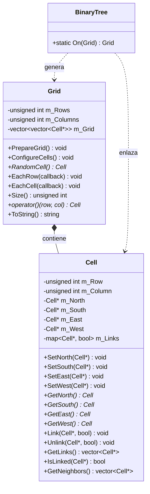
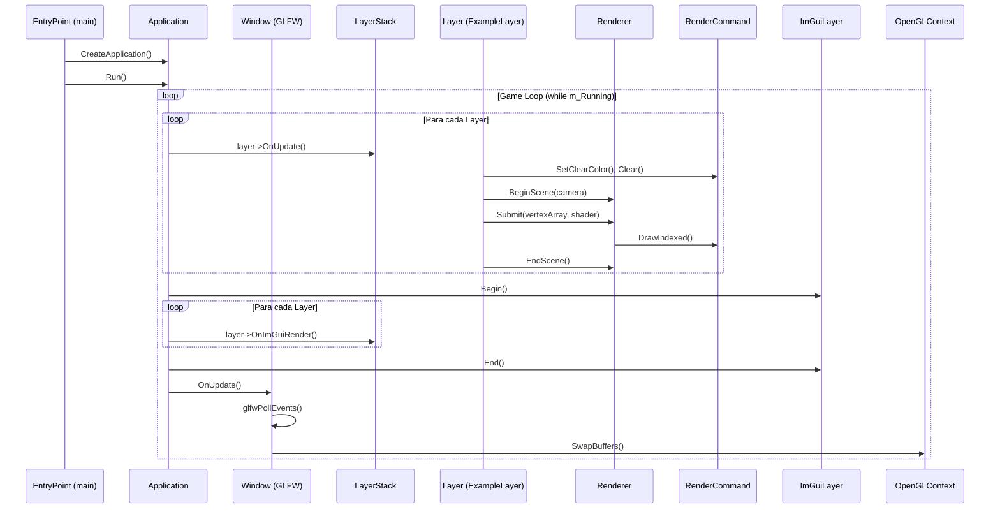
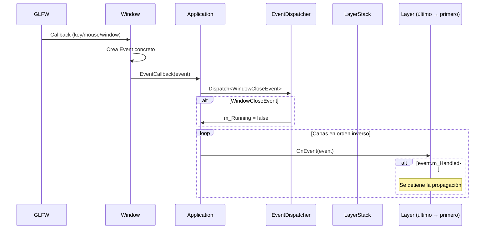
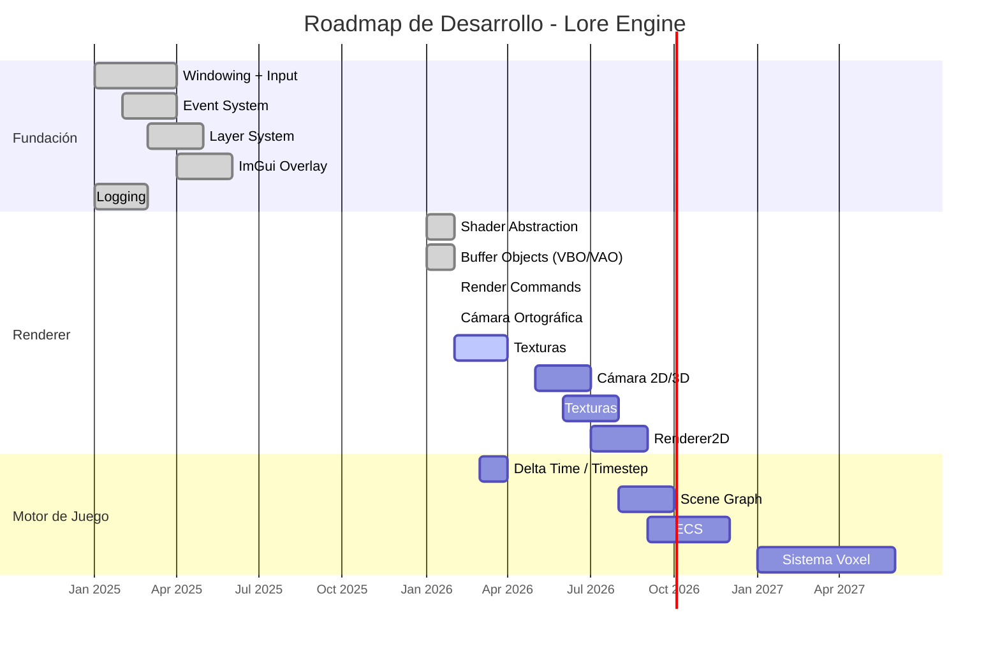

# Lore Engine

**Lore Engine** es un motor de juegos cross-platform enfocado en manipulación voxel, construido con C++ moderno y OpenGL 4.1.

El proyecto cuenta con una **base sólida de renderizado**: sistema de ventanas, eventos, input, capas, ImGui, y un renderer abstraído con cámara ortográfica están completamente funcionales.

---

## Características Implementadas

- **Soporte Cross-Platform**: Windows (x64) y macOS (ARM64)
- **Renderer Abstraction**: Sistema completo con Shader, VertexBuffer, IndexBuffer, VertexArray, RenderCommand y Renderer
- **Cámara Ortográfica**: OrthographicCamera con posición, rotación y matrices View/Projection
- **Matemáticas con glm**: Vectores, matrices y transformaciones integradas
- **Arquitectura por Capas**: Sistema modular de `Layer`/`LayerStack` para organizar lógica de juego y renderizado
- **Sistema de Eventos**: Despacho inmediato con tipado seguro y categorías (Application, Input, Keyboard, Mouse)
- **Integración ImGui**: Overlay de Dear ImGui con soporte de docking y viewports múltiples
- **Sistema de Logging**: Logger dual (Core/Client) sobre spdlog con formato coloreado
- **OpenGL Moderno**: Contexto OpenGL 4.1 con GLAD loader y ventanas GLFW
- **Input Polling**: Consulta de estado de teclado y ratón en cualquier momento del frame

---

## Arquitectura

### Diagrama General

```mermaid
graph TB
    subgraph Sandbox["Sandbox (ConsoleApp)"]
        SandboxApp["Sandbox : Application"]
        ExampleLayer["ExampleLayer : Layer"]
        SandboxApp -->|PushLayer| ExampleLayer

        subgraph MazeModule["Maze Module"]
            MazeGrid["Grid<br/><i>matriz de celdas</i>"]
            MazeCell["Cell<br/><i>conexiones N/S/E/W</i>"]
            BinaryTree["BinaryTree<br/><i>algoritmo generador</i>"]
            MazeGrid -->|contiene| MazeCell
            BinaryTree -->|genera| MazeGrid
        end
        ExampleLayer --> MazeModule
    end

    subgraph LoreEngine["Lore Engine (StaticLib)"]

        subgraph Core["Core"]
            Application["Application<br/><i>Singleton, game loop</i>"]
            EntryPoint["EntryPoint.h<br/><i>define main()</i>"]
            Log["Log<br/><i>spdlog wrapper</i>"]
            CoreH["Core.h<br/><i>macros, asserts</i>"]
        end

        subgraph LayerSystem["Layer System"]
            LayerStack["LayerStack<br/><i>contenedor ordenado</i>"]
            Layer["Layer<br/><i>base class</i>"]
            ImGuiLayer["ImGuiLayer : Layer<br/><i>overlay de debug</i>"]
            LayerStack -->|contiene| Layer
            LayerStack -->|contiene| ImGuiLayer
        end

        subgraph Events["Event System"]
            Event["Event<br/><i>abstract base</i>"]
            EventDispatcher["EventDispatcher<br/><i>template dispatch</i>"]
            WindowEvents["WindowClose<br/>WindowResize"]
            KeyEvents["KeyPressed<br/>KeyReleased<br/>KeyTyped"]
            MouseEvents["MouseMoved<br/>MouseScrolled<br/>MouseButton*"]
            Event --- WindowEvents
            Event --- KeyEvents
            Event --- MouseEvents
        end

        subgraph InputSystem["Input"]
            Input["Input<br/><i>singleton virtual</i>"]
            KeyCodes["KeyCodes.h<br/><i>120+ macros</i>"]
            MouseCodes["MouseButtonCodes.h"]
        end

        subgraph Platform["Platform Layer"]
            subgraph WinPlatform["Windows"]
                WindowsWindow["WindowsWindow : Window"]
                WindowsInput["WindowsInput : Input"]
            end
            subgraph MacPlatform["macOS"]
                MacWindow["MacWindow : Window"]
                MacInput["MacInput : Input"]
            end
            subgraph OpenGLPlatform["OpenGL"]
                OpenGLContext["OpenGLContext : GraphicsContext"]
            end
        end

        subgraph Renderer["Renderer"]
            Window["Window<br/><i>interfaz pura</i>"]
            GraphicsContext["GraphicsContext<br/><i>interfaz pura</i>"]
            RendererClass["Renderer<br/><i>BeginScene/Submit/EndScene</i>"]
            RenderCommand["RenderCommand<br/><i>comandos estáticos</i>"]
            ShaderClass["Shader<br/><i>uniforms, bind</i>"]
            BufferClasses["VertexBuffer / IndexBuffer"]
            VertexArrayClass["VertexArray"]
            CameraClass["OrthographicCamera<br/><i>View/Projection matrices</i>"]
        end
    end

    SandboxApp -.->|extends| Application
    Application --> LayerStack
    Application --> Window
    Application --> Log
    Application --> ImGuiLayer
    Window -.->|implementa| WindowsWindow
    Window -.->|implementa| MacWindow
    GraphicsContext -.->|implementa| OpenGLContext
    Input -.->|implementa| WindowsInput
    Input -.->|implementa| MacInput
    WindowsWindow --> OpenGLContext
    MacWindow --> OpenGLContext
    EntryPoint -->|crea| Application

    subgraph Vendors["Dependencias (vendor/)"]
        GLFW["GLFW<br/><i>ventanas + input</i>"]
        GLAD["GLAD<br/><i>OpenGL loader</i>"]
        IMGUI["Dear ImGui<br/><i>GUI inmediata</i>"]
        spdlog["spdlog<br/><i>logging</i>"]
        glm["glm<br/><i>matrices, vectores</i>"]
    end

    WindowsWindow --> GLFW
    MacWindow --> GLFW
    OpenGLContext --> GLAD
    ImGuiLayer --> IMGUI
    Log --> spdlog
```



### Diagrama de Clases

```mermaid
classDiagram
    class Application {
        -unique_ptr~Window~ m_Window
        -ImGuiLayer* m_ImGuiLayer
        -bool m_Running
        -LayerStack m_LayerStack
        -static Application* s_Instance
        +Run() void
        +OnEvent(Event&) void
        +PushLayer(Layer*) void
        +PushOverlay(Layer*) void
        +static Get() Application&
        +GetWindow() Window&
    }

    class Renderer {
        -static SceneData* s_SceneData
        +static BeginScene(OrthographicCamera&) void
        +static Submit(VertexArray, Shader) void
        +static EndScene() void
        +static GetAPI() API
    }

    class OrthographicCamera {
        -mat4 m_ProjectionMatrix
        -mat4 m_ViewMatrix
        -mat4 m_ViewProjectionMatrix
        -vec3 m_Position
        -float m_Rotation
        +SetPosition(vec3) void
        +SetRotation(float) void
        +GetViewProjectionMatrix() mat4
    }

    class Shader {
        -unsigned int m_RendererID
        +Bind() void
        +Unbind() void
        +SetUniformMat4f(name, mat4) void
    }

    class VertexArray {
        <<interface>>
        +Bind()* void
        +Unbind()* void
        +AddVertexBuffer(VertexBuffer*)* void
        +SetIndexBuffer(IndexBuffer*)* void
        +static Create() VertexArray*
    }

    class Window {
        <<interface>>
        +OnUpdate()* void
        +GetWidth()* uint
        +GetHeight()* uint
        +SetEventCallback(fn)* void
        +SetVSync(bool)* void
        +IsVSync()* bool
        +GetNativeWindow()* void*
        +static Create(WindowProps) Window*
    }

    class GraphicsContext {
        <<interface>>
        +Init()* void
        +SwapBuffers()* void
    }

    class Input {
        <<abstract>>
        -static Input* s_Instance
        +static IsKeyPressed(int) bool
        +static IsMouseButtonPressed(int) bool
        +static GetMousePosition() pair
        #IsKeyPressedImpl(int)* bool
        #IsMouseButtonPressedImpl(int)* bool
        #GetMousePositionImpl()* pair
    }

    class Layer {
        -string m_DebugName
        +OnAttach() void
        +OnDetach() void
        +OnUpdate() void
        +OnImGuiRender() void
        +OnEvent(Event&) void
        +GetName() string
    }

    class LayerStack {
        -vector~Layer*~ m_Layers
        -unsigned int m_LayerInsertIndex
        +PushLayer(Layer*) void
        +PushOverlay(Layer*) void
        +PopLayer(Layer*) void
        +PopOverlay(Layer*) void
        +begin() iterator
        +end() iterator
    }

    class Event {
        <<abstract>>
        +bool m_Handled
        +GetEventType()* EventType
        +GetName()* string
        +GetCategoryFlags()* int
        +IsInCategory(EventCategory) bool
        +ToString() string
    }

    class Log {
        -static shared_ptr s_CoreLogger
        -static shared_ptr s_ClientLogger
        +static Init() void
        +static GetCoreLogger()
        +static GetClientLogger()
    }

    class ImGuiLayer {
        +OnAttach() void
        +OnDetach() void
        +OnImGuiRender() void
        +Begin() void
        +End() void
    }

    class WindowsWindow {
        -GLFWwindow* m_Window
        -GraphicsContext* m_Context
        -WindowData m_Data
    }
    class MacWindow {
        -GLFWwindow* m_Window
        -GraphicsContext* m_Context
        -WindowData m_Data
    }
    class OpenGLContext {
        -GLFWwindow* m_WindowHandle
        +Init() void
        +SwapBuffers() void
    }
    class WindowsInput
    class MacInput

    Application *-- LayerStack
    Application *-- Window
    Application --> ImGuiLayer
    Application --> Log

    LayerStack o-- Layer
    ImGuiLayer --|> Layer

    Window <|.. WindowsWindow
    Window <|.. MacWindow
    GraphicsContext <|.. OpenGLContext
    Input <|.. WindowsInput
    Input <|.. MacInput

    WindowsWindow --> OpenGLContext
    MacWindow --> OpenGLContext

    Event <|-- KeyEvent
    Event <|-- MouseMovedEvent
    Event <|-- MouseScrolledEvent
    Event <|-- MouseButtonEvent
    Event <|-- WindowResizeEvent
    Event <|-- WindowCloseEvent
    KeyEvent <|-- KeyPressedEvent
    KeyEvent <|-- KeyReleasedEvent
    KeyEvent <|-- KeyTypedEvent
    MouseButtonEvent <|-- MouseButtonPressedEvent
    MouseButtonEvent <|-- MouseButtonReleasedEvent
```



### Diagrama de Clases - Módulo Maze



### Flujo del Game Loop



### Flujo de Eventos



---

## Estructura del Proyecto

```text
Lore/                          # Raíz del workspace
├── premake5.lua               # Build system principal (Premake5)
├── Lore.slnx                  # Solución Visual Studio
├── WindowsSetupPremake.bat    # Descarga Premake para Windows
├── WindowsSetupProject.bat    # Genera proyecto Visual Studio
│
├── Lore/                      # Motor (StaticLib)
│   ├── src/
│   │   ├── Lore.h             # Header público único (include todo)
│   │   ├── lrpch.h / .cpp     # Precompiled header
│   │   └── Lore/
│   │       ├── Application.h/.cpp    # Singleton, game loop, ventana
│   │       ├── Core.h               # Macros: plataforma, asserts, BIT()
│   │       ├── EntryPoint.h          # Define main()
│   │       ├── Input.h              # Singleton abstracto de input
│   │       ├── KeyCodes.h           # 120+ macros LR_KEY_*
│   │       ├── MouseButtonCodes.h   # 8 botones de ratón
│   │       ├── Layer.h/.cpp         # Clase base Layer
│   │       ├── LayerStack.h/.cpp    # Contenedor ordenado de capas
│   │       ├── Log.h/.cpp           # Wrapper spdlog (Core + Client)
│   │       ├── Window.h             # Interfaz pura de ventana
│   │       │
│   │       ├── Events/              # Sistema de eventos
│   │       │   ├── Event.h          # Base abstracta + EventDispatcher
│   │       │   ├── ApplicationEvent.h  # WindowClose, WindowResize, AppTick...
│   │       │   ├── KeyEvent.h       # KeyPressed, KeyReleased, KeyTyped
│   │       │   └── MouseEvent.h     # MouseMoved, MouseScrolled, MouseButton*
│   │       │
│   │       ├── ImGui/               # Integración Dear ImGui
│   │       │   ├── ImGuiLayer.h/.cpp   # Capa overlay (docking + viewports)
│   │       │   ├── ImGuiBuild.cpp      # Unity build de backends ImGui
│   │       │   └── ImGuiKeyCodes.h     # Mapeo LR_KEY → ImGuiKey (sin usar)
│   │       │
│   │       ├── Platform/            # Implementaciones por plataforma
│   │       │   ├── Windows/
│   │       │   │   ├── WindowsWindow.h/.cpp  # GLFW window para Windows
│   │       │   │   └── WindowsInput.h/.cpp   # Input polling para Windows
│   │       │   ├── Mac/
│   │       │   │   ├── MacWindow.h/.cpp      # GLFW window para macOS
│   │       │   │   └── MacInput.h/.cpp       # Input polling para macOS
│   │       │   └── OpenGL/
│   │       │       └── OpenGLContext.h/.cpp   # Init GLAD + swap buffers
│   │       │
│   │       └── Renderer/            # Sistema de renderizado
│   │           ├── GraphicsContext.h    # Interfaz pura (Init + SwapBuffers)
│   │           ├── Renderer.h/.cpp      # BeginScene, Submit, EndScene
│   │           ├── RenderCommand.h      # Comandos estáticos de renderizado
│   │           ├── RendererAPI.h/.cpp   # Abstracción de API gráfica
│   │           ├── Shader.h/.cpp        # Compilación GLSL + uniforms
│   │           ├── Buffer.h/.cpp        # VertexBuffer, IndexBuffer, BufferLayout
│   │           ├── VertexArray.h/.cpp   # Vertex Array Objects
│   │           └── OrthographicCamera.h/.cpp  # Cámara 2D con transformaciones
│   │
│   └── vendor/                # Dependencias del motor
│       ├── GLFW/              # Windowing y input nativo
│       ├── GLAD/              # OpenGL function loader
│       ├── IMGUI/             # Dear ImGui (rama docking)
│       ├── glm/               # Matemáticas (incluido, sin usar aún)
│       └── spdlog/            # Logging rápido (header-only)
│
├── Sandbox/                   # Aplicación de ejemplo (ConsoleApp)
│   └── src/
│       ├── SandboxApp.cpp     # ExampleLayer + CreateApplication()
│       └── Maze/              # Sistema de generación de laberintos
│           ├── Base/
│           │   ├── Cell.h/.cpp   # Celda con enlaces N/S/E/W
│           │   └── Grid.h/.cpp   # Matriz 2D + iteradores + ToString()
│           └── Algorithms/
│               └── BinaryTree.h/.cpp  # Generador procedural
│
├── Scripts/                   # Scripts de build
│   └── Macos/
│       ├── Helpers/           # RunDebugSandboxProject, RunPremake
│       └── Main/              # Bootstrap.sh
│
├── Docs/                      # Documentación
│   └── Diagrams/
│       └── Architecture.plantuml
│
└── vendor/                    # Herramientas de build
    └── premake/               # Binarios de Premake5
```

---

## Jerarquía de Clases

```text
GraphicsContext (interfaz)
└── OpenGLContext

RendererAPI (interfaz)
└── OpenGLRendererAPI

Shader
└── (Implementación OpenGL directa)

VertexBuffer (interfaz + factory)
└── OpenGLVertexBuffer

IndexBuffer (interfaz + factory)
└── OpenGLIndexBuffer

VertexArray (interfaz + factory)
└── OpenGLVertexArray

OrthographicCamera
└── (Clase concreta con glm)

Window (interfaz + factory)
├── WindowsWindow
└── MacWindow

Input (singleton + virtual dispatch)
├── WindowsInput
└── MacInput

Event (abstracta)
├── WindowResizeEvent
├── WindowCloseEvent
├── AppTickEvent / AppUpdateEvent / AppRenderEvent
├── KeyEvent (abstracta)
│   ├── KeyPressedEvent
│   ├── KeyReleasedEvent
│   └── KeyTypedEvent
├── MouseMovedEvent
├── MouseScrolledEvent
└── MouseButtonEvent (abstracta)
    ├── MouseButtonPressedEvent
    └── MouseButtonReleasedEvent

Layer (base, todos los métodos virtuales son no-op)
└── ImGuiLayer

Application (singleton, el cliente hereda de esta)
└── Sandbox (código cliente)
    └── ExampleLayer

Maze (módulo independiente en Sandbox)
├── Grid (matriz 2D de celdas)
│   └── Cell (celda con enlaces N/S/E/W)
└── Algorithms
    └── BinaryTree (generador de laberintos)
```

---

## Dependencias

| Librería                                       | Versión / Rama | Propósito                                                       |
| ---------------------------------------------- | -------------- | --------------------------------------------------------------- |
| [GLFW](https://www.glfw.org/)                  | —              | Creación de ventanas, contexto OpenGL, input nativo             |
| [GLAD](https://glad.dav1d.de/)                 | OpenGL 4.1     | Loader de funciones OpenGL                                      |
| [Dear ImGui](https://github.com/ocornut/imgui) | Rama docking   | GUI inmediata con docking y multi-viewports                     |
| [spdlog](https://github.com/gabime/spdlog)     | Header-only    | Logging rápido con formato y colores                            |
| [glm](https://github.com/g-truc/glm)           | —              | Matemáticas (vectores, matrices) para cámara y transformaciones |
| [Premake5](https://premake.github.io/)         | —              | Generación de proyectos (VS, Makefiles)                         |

---

## Estado del Proyecto

### Implementado

| Módulo                   | Estado    | Descripción                                                                |
| ------------------------ | --------- | -------------------------------------------------------------------------- |
| Windowing (GLFW)         | Completo  | Creación de ventana, VSync, callbacks. Windows + Mac                       |
| Sistema de Eventos       | Completo  | Despacho inmediato por tipo con `EventDispatcher`. 14 tipos de evento      |
| Input Polling            | Completo  | Teclado + ratón, ambas plataformas                                         |
| Logging (spdlog)         | Completo  | Logger dual Core (`LORE`) / Client (`APP`) con macros                      |
| Sistema de Capas         | Completo  | `LayerStack` con capas normales y overlays. Propagación inversa de eventos |
| Integración ImGui        | Completo  | Docking, viewports múltiples, demo window, backends GLFW + OpenGL3         |
| Contexto OpenGL          | Completo  | OpenGL 4.1, GLAD loader, info de GPU al inicio                             |
| **Renderer Abstraction** | Completo  | Renderer, RenderCommand, RendererAPI, Shader, Buffer, VertexArray          |
| **Cámara Ortográfica**   | Completo  | OrthographicCamera con posición, rotación, matrices View/Projection        |
| **glm Integration**      | Completo  | Matrices y vectores para transformaciones de cámara                        |
| Triángulo de prueba      | Funcional | Renderizado con abstracción completa y cámara controlable                  |

### En Progreso / Pendiente

| Módulo                        | Estado              | Notas                                                                 |
| ----------------------------- | ------------------- | --------------------------------------------------------------------- |
| Delta Time                    | **No implementado** | `OnUpdate()` no recibe timestep                                       |
| Event Buffering               | **No implementado** | Los eventos se despachan inmediatamente (trabajo futuro en `Event.h`) |
| Eventos WindowFocus/Move      | **No implementado** | Los enum values existen pero no hay callbacks GLFW que los disparen   |
| Texturas                      | **No iniciado**     | No hay sistema de carga/binding de texturas                           |
| Renderer2D                    | **No iniciado**     | Batching de sprites/quads                                             |
| Scene Graph                   | **No iniciado**     | —                                                                     |
| ECS (Entity Component System) | **No iniciado**     | —                                                                     |
| Audio                         | **No iniciado**     | —                                                                     |
| Física                        | **No iniciado**     | —                                                                     |
| Voxel System                  | **No iniciado**     | Objetivo final del motor                                              |

### Roadmap Sugerido



---

## Sandbox - Aplicación de Ejemplo

El proyecto **Sandbox** es una aplicación de demostración que muestra las capacidades del motor Lore Engine.

### ExampleLayer

La capa principal que demuestra:

- **Renderizado**: Triángulo con colores por vértice usando el sistema de renderizado abstraído
- **Cámara Controlable**: Movimiento con flechas (↑↓←→), rotación con Q/E
- **Generación de Laberintos**: Algoritmo BinaryTree mostrado en ventana ImGui

### Controles

| Tecla | Acción                              |
| ----- | ----------------------------------- |
| ← →   | Mover cámara horizontalmente        |
| ↑ ↓   | Mover cámara verticalmente          |
| Q     | Rotar cámara en sentido antihorario |
| E     | Rotar cámara en sentido horario     |

### Módulo Maze

Sistema de generación procedural de laberintos implementado como ejemplo de lógica de juego independiente del motor.

#### Estructura

```text
Maze/
├── Base/
│   ├── Cell.h/.cpp     # Celda individual del laberinto
│   └── Grid.h/.cpp     # Matriz 2D de celdas
└── Algorithms/
    └── BinaryTree.h/.cpp  # Algoritmo de generación
```

#### Clases

**Cell** - Representa una celda del laberinto:

- Coordenadas (fila, columna)
- Referencias a vecinos (North, South, East, West)
- Sistema de enlaces bidireccionales entre celdas
- Métodos: `Link()`, `Unlink()`, `IsLinked()`, `GetNeighbors()`

**Grid** - Matriz contenedora de celdas:

- Dimensiones configurables (filas × columnas)
- Iteradores `EachRow()` y `EachCell()` con callbacks
- Acceso por coordenadas con `operator()(row, col)`
- Método `ToString()` para representación ASCII
- Método `RandomCell()` para selección aleatoria

**BinaryTree** - Algoritmo de generación:

- Método estático `On(Grid)` que procesa el grid
- Para cada celda, elige aleatoriamente entre Norte o Este
- Crea enlaces (pasajes) entre celdas adyacentes
- Produce laberintos con sesgo hacia esquina NE

#### Ejemplo de Uso

```cpp
#include "Maze/Algorithms/BinaryTree.h"

// Crear grid de 50x50 celdas
Maze::Grid grid{ 50, 50 };

// Aplicar algoritmo BinaryTree
grid = Maze::BinaryTree::On(grid);

// Obtener representación ASCII
std::string mazeString = grid.ToString();

// Mostrar en ImGui
ImGui::Text("%s", mazeString.c_str());
```

#### Salida de Ejemplo

```text
+---+---+---+---+---+
|               |   |
+   +---+---+   +   +
|   |       |   |   |
+   +   +---+   +   +
|   |   |   |       |
+---+---+---+---+---+
```

---

## Building

### Requisitos Previos

- Compilador C++17 o superior
- **macOS**: Xcode Command Line Tools
- **Windows**: Visual Studio 2019+ (recomendado 2022)

### Windows

```batch
:: 1. Descargar Premake5
WindowsSetupPremake.bat

:: 2. Generar solución Visual Studio
WindowsSetupProject.bat
```

Luego abrir `Lore.slnx` en Visual Studio y compilar. El proyecto `Sandbox` está configurado como startup project.

### macOS (ARM64)

```bash
# Bootstrap premake y generar makefiles
./Scripts/Macos/Main/Bootstrap.sh

# Compilar y ejecutar
make config=debug_macosx-aarch64
./bin/Debug-macosx-AARCH64/Sandbox/Sandbox
```

---

## Uso

### Crear una Aplicación

El motor define `main()` internamente mediante `EntryPoint.h`. Solo necesitas definir `CreateApplication()`:

```cpp
#include <Lore.h>
#include <imgui.h>

class GameLayer : public Lore::Layer {
private:
    std::shared_ptr<Lore::Shader> m_Shader;
    std::shared_ptr<Lore::VertexArray> m_VertexArray;
    Lore::OrthographicCamera m_Camera;
    glm::vec3 m_CameraPosition{ 0.0f, 0.0f, 0.0f };

public:
    GameLayer() : Layer("Game"), m_Camera(-1.6f, 1.6f, -0.9f, 0.9f) {
        // Configurar vertex array, buffers y shader...
        m_VertexArray.reset(Lore::VertexArray::Create());
        // ... (ver SandboxApp.cpp para ejemplo completo)
    }

    void OnUpdate() override {
        // Control de cámara
        if (Lore::Input::IsKeyPressed(LR_KEY_LEFT))
            m_CameraPosition.x -= 0.05f;
        if (Lore::Input::IsKeyPressed(LR_KEY_RIGHT))
            m_CameraPosition.x += 0.05f;

        m_Camera.SetPosition(m_CameraPosition);

        // Renderizado
        Lore::RenderCommand::SetClearColor({ 0.1f, 0.1f, 0.1f, 1 });
        Lore::RenderCommand::Clear();

        Lore::Renderer::BeginScene(m_Camera);
        Lore::Renderer::Submit(m_VertexArray, m_Shader);
        Lore::Renderer::EndScene();
    }

    void OnImGuiRender() override {
        ImGui::Begin("Debug");
        ImGui::Text("Camera: %.2f, %.2f", m_CameraPosition.x, m_CameraPosition.y);
        ImGui::End();
    }
};

class MyGame : public Lore::Application {
public:
    MyGame() {
        PushLayer(new GameLayer());
    }
};

Lore::Application* Lore::CreateApplication() {
    return new MyGame();
}
```

> **Nota**: `ImGuiLayer` se añade automáticamente como overlay en el constructor de `Application`. No es necesario añadirlo manualmente.

### Sistema de Logging

```cpp
// Logger del motor (LORE)
LR_CORE_INFO("Motor inicializado");
LR_CORE_WARN("Advertencia: {0}", mensaje);
LR_CORE_ERROR("Error: código {0}", codigo);
LR_CORE_TRACE("Frame {0}", frameCount);

// Logger del cliente (APP)
LR_INFO("Jugador en ({0}, {1})", x, y);
LR_WARN("Vida baja: {0}", salud);
LR_ERROR("No se pudo cargar: {0}", archivo);
```

### Input Polling

```cpp
// En cualquier momento dentro de OnUpdate()
if (Lore::Input::IsKeyPressed(LR_KEY_SPACE))
    // saltar

if (Lore::Input::IsMouseButtonPressed(LR_MOUSE_BUTTON_LEFT))
    // clic izquierdo

auto [x, y] = Lore::Input::GetMousePosition();
```

### Sistema de Renderizado

```cpp
// Crear recursos
auto vertexArray = std::shared_ptr<Lore::VertexArray>(Lore::VertexArray::Create());
auto vertexBuffer = std::shared_ptr<Lore::VertexBuffer>(
    Lore::VertexBuffer::Create(vertices, sizeof(vertices)));

vertexBuffer->SetLayout({
    { Lore::ShaderDataType::Float3, "a_Position" },
    { Lore::ShaderDataType::Float4, "a_Color" },
});
vertexArray->AddVertexBuffer(vertexBuffer);

auto indexBuffer = std::shared_ptr<Lore::IndexBuffer>(
    Lore::IndexBuffer::Create(indices, count));
vertexArray->SetIndexBuffer(indexBuffer);

// Crear shader (GLSL)
auto shader = std::shared_ptr<Lore::Shader>(
    new Lore::Shader(vertexSource, fragmentSource));

// Crear cámara
Lore::OrthographicCamera camera(-1.6f, 1.6f, -0.9f, 0.9f);
camera.SetPosition({ 0.0f, 0.0f, 0.0f });
camera.SetRotation(0.0f);

// En el game loop (OnUpdate)
Lore::RenderCommand::SetClearColor({ 0.1f, 0.1f, 0.1f, 1.0f });
Lore::RenderCommand::Clear();

Lore::Renderer::BeginScene(camera);
Lore::Renderer::Submit(vertexArray, shader);
Lore::Renderer::EndScene();
```

---

## Configuraciones de Build

| Config  | Defines                         | Descripción                                      |
| ------- | ------------------------------- | ------------------------------------------------ |
| Debug   | `LR_DEBUG`, `LR_ENABLE_ASSERTS` | Símbolos de debug completos, asserts habilitados |
| Release | `LR_RELEASE`                    | Build optimizado                                 |
| Dist    | `LR_DIST`                       | Distribución, optimización máxima                |

---

## Patrones de Diseño Utilizados

| Patrón              | Uso                                                                                       |
| ------------------- | ----------------------------------------------------------------------------------------- |
| **Singleton**       | `Application`, `Input` — acceso global a instancia única                                  |
| **Factory Method**  | `Window::Create()`, `VertexArray::Create()`, `Buffer::Create()` — creación por plataforma |
| **Observer**        | Sistema de eventos — callbacks GLFW → `Event` → `Application` → `Layer`                   |
| **Template Method** | `Layer` — define hooks virtuales que las subclases implementan                            |
| **Strategy**        | `Input`, `Window`, `RendererAPI` — interfaz común con implementaciones intercambiables    |
| **Composite**       | `LayerStack` — colección ordenada de `Layer` con iteración uniforme                       |
| **Command**         | `RenderCommand` — encapsula operaciones de renderizado como métodos estáticos             |

---

## Licencia

Este proyecto está bajo la Licencia MIT — ver el archivo [LICENSE](LICENSE) para más detalles.

Copyright (c) 2026 Bruno Vitte
